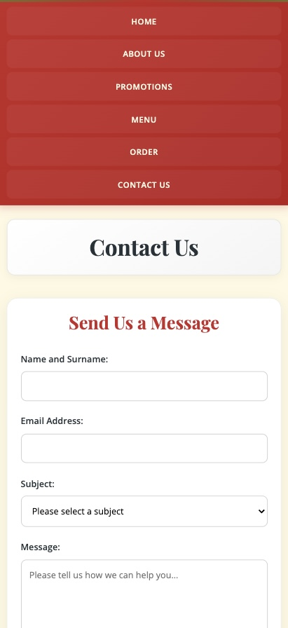
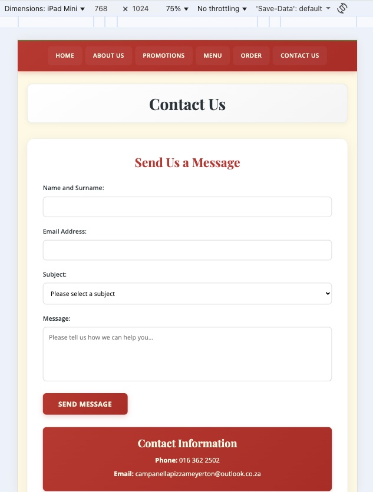
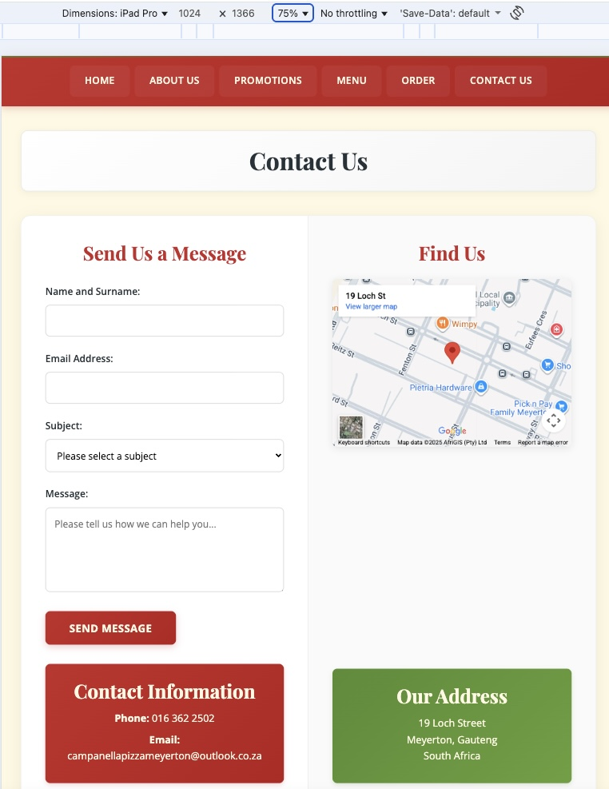
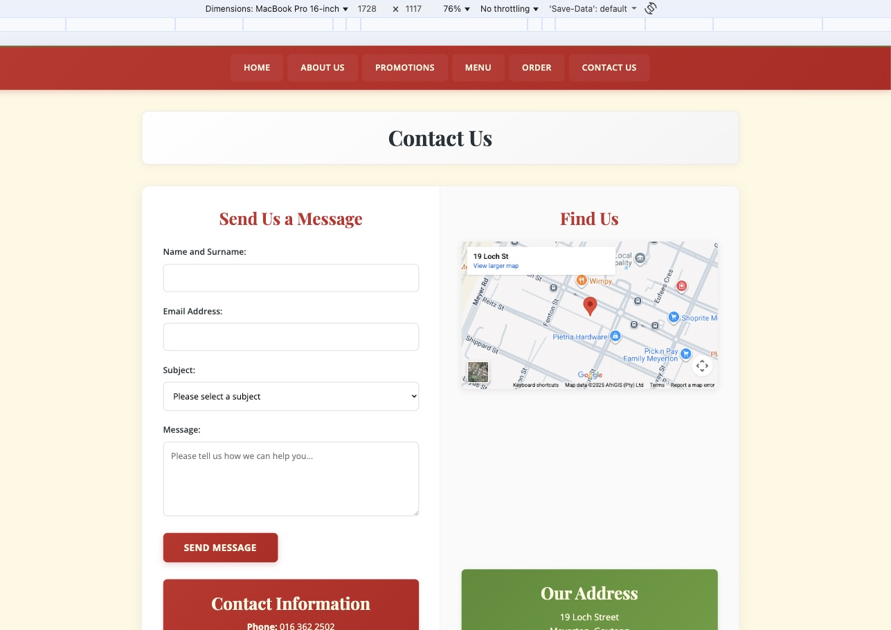
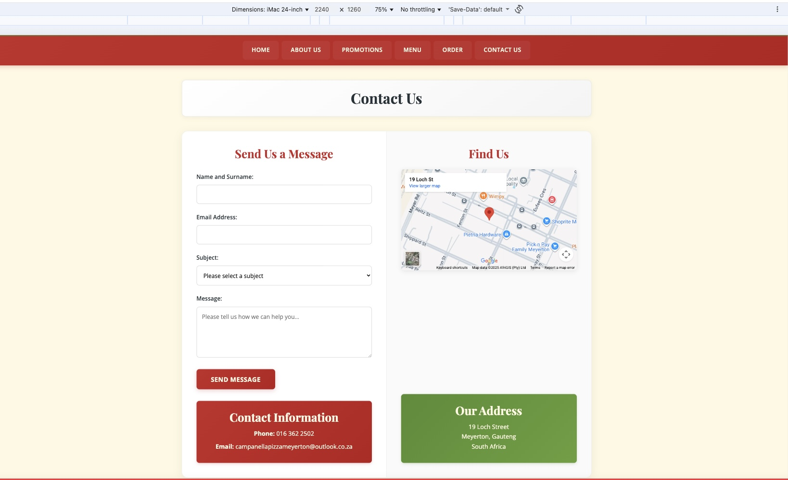

# Campanella Pizza Website

**By ST10433587**

## Project Overview

This project involves the development of a comprehensive website for Campanella Pizza, a family-owned pizzeria located in Meyerton, South Africa. The website serves as the digital presence for this local business that has been serving the community since 2014, specialising in authentic wood-fired pizzas.

The Campanella Pizza website development project spans 12 weeks from 21 July 2025 to 14 October 2025. This structured approach divides the work into three distinct phases, each building upon the previous foundation to create a comprehensive online presence for the restaurant.

The development of this website addresses the current lack of online presence for Campanella Pizza. Through direct interviews conducted with the owners and staff on 26 July 2025, comprehensive insights were gathered regarding business operations, customer needs, and website requirements. This information serves as the foundation for creating a digital platform that accurately represents the restaurant's values and offerings.

The website showcases Campanella Pizza's commitment to delivering authentic, high-quality pizza made with locally sourced ingredients, while providing exceptional service in a warm and welcoming environment. The digital platform reflects the restaurant's mission to become Meyerton's most loved local pizzeria through excellence in food and service.

## Website Goals and Objectives

### Primary Goals

The website has been designed to achieve several key business objectives:

- **Menu Accessibility**: Customers can view the complete menu online, providing convenient access to all available pizzas, drinks, and extras without needing to visit the physical location or make phone calls for information.

- **Online Ordering Capability**: The platform enables customers to place orders directly through the website, streamlining the ordering process and reducing phone-based transactions.

- **Enhanced Visibility**: The website increases brand awareness and online presence, making Campanella Pizza more discoverable to potential customers in Meyerton and surrounding areas.

- **Promotional Platform**: Special offers, events, and promotional deals are prominently featured to drive sales and customer engagement.

- **Customer Relationship Building**: Newsletter subscription functionality allows the restaurant to maintain ongoing communication with customers, building loyalty and encouraging repeat business.

### Key Performance Indicators

The success of the website will be measured through several metrics:

- Monthly website traffic to gauge overall reach and engagement
- Number of online orders placed through the platform
- Click-through rates on promotional banners to assess marketing effectiveness
- Newsletter subscription numbers to measure customer loyalty building
- Bounce rate analysis to evaluate user engagement and content relevance

## Target Audience

The website specifically caters to:

- Local families and individuals residing in Meyerton
- Students and young adults seeking convenient food options
- Pizza enthusiasts within a 20-kilometre radius of the restaurant
- Community members looking for authentic Italian-style dining experiences

## Key Features and Functionality

### Essential Pages Structure

The website comprises six main sections, each serving specific user needs:

**Homepage (index.html)**: Acts as the digital storefront featuring hero imagery with Campanella Pizza branding, brief restaurant introduction, prominent call-to-action buttons for menu viewing and online ordering, comprehensive navigation menu, featured pizza specials, and footer contact information.

**About Us (about.html)**: Tells the restaurant's story, including the business history since 2014, mission and vision statements, information about wood-fired pizza preparation methods, emphasis on family-owned business values, and photographs of the restaurant and staff.

**Menu (menu.html)**: Provides comprehensive product information organised into pizza categories (meat and vegetarian options), detailed descriptions with pricing, complete drink selection, additional items such as salads and sides, current special deals, and allergen information where applicable.

**Contact (contact.html)**: Offers multiple communication channels, including a contact form for general enquiries, complete restaurant address, phone number and email address, embedded Google Maps showing precise location, and detailed business operating hours.

**Online Ordering (order.html)**: Enables direct customer transactions through menu selection interface, shopping cart functionality, and a customer details collection system.

**Promotions Page**: Dedicated space for highlighting current specials, seasonal offers, and special events to drive customer engagement and sales.

### Core Functionality

**Mobile Responsiveness**: The website adapts seamlessly across all device types, ensuring optimal user experience on smartphones, tablets, and desktop computers.

**Shopping Cart System**: Customers can add multiple items to their cart, modify quantities, and review orders before completion.

**Location Integration**: Google and Apple Maps integration provides precise location information and driving directions.

**Communication Tools**: Contact forms enable direct customer enquiries, whilst social media integration connects customers to the restaurant's broader online presence.

**User Experience Optimisation**: The design prioritises simplicity and efficiency, allowing visitors to access menu information and place orders with minimal clicks whilst maintaining high contrast for readability and consistent visual branding throughout all pages.

## Technical Implementation

Through the use of GitHub and VS Code, the website utilises modern web technologies, including HTML5 for semantic structure, CSS for visual styling and responsive design, and JavaScript for interactive functionality. The responsive framework ensures compatibility across all devices and screen sizes.

Hosting is provided through Afrihost with the domain www.campanellapizza.co.za, ensuring reliable South African-based service. The technical architecture supports future scalability and maintenance requirements.

## Content Strategy

All website content has been developed through primary research, including direct interviews with restaurant owners and staff. Visual elements utilise legally sourced stock photography from FreePik, professional typography from Google Fonts, and carefully selected colour schemes from ColorHunt that reflect the authentic Italian dining experience.

The content strategy emphasises local relevance whilst maintaining professional presentation standards that build customer trust and encourage online ordering behaviour.

## Development Timeline

### Phase 1: Foundation (Weeks 1 - 5)

**Duration**: 21 July - 25 August 2025

The initial phase focuses on establishing the groundwork for the entire project. During the first week, the team conducts thorough research into the organisation's needs and submits the project proposal whilst setting up the GitHub repository. Week two involves detailed content planning, including finalising the sitemap design and creating wireframes for all pages. The third and fourth weeks concentrate on HTML development, building the structural foundation for all five pages using semantic HTML tags and implementing a functional navigation system. The final week of this phase involves comprehensive testing, validation, and preparation for the first submission deadline on 27 August 2025.

## Phase 2: Visual Design and Responsive Development (Weeks 6 - 9)

**Duration**: 25 August - 26 September 2025

This phase focused on transforming the HTML foundation into a visually appealing and responsive website using CSS styling techniques.

### Week 6: CSS Foundation and Base Styling
**Dates**: 25 August - 1 September 2025
- Created external CSS stylesheet (`css/style.css`) and linked to all HTML pages
- Implemented CSS reset for cross-browser consistency
- Established base typography using Google Fonts (Playfair Display for headings, Open Sans for body text)
- Applied colour scheme based on Italian restaurant aesthetic:
  - Primary: Tomato Red (#C62828)
  - Secondary: Mozzarella White (#FFF8E1)
  - Accent: Olive Green (#558B2F)
  - Text: Charcoal Black (#263238)
- Set default styling for consistent font family, sizes, and spacing

### Week 7: Advanced CSS and Layout Development
**Dates**: 1 - 8 September 2025
- Implemented CSS Grid and Flexbox layouts for structured content presentation
- Created responsive navigation menu with hover effects
- Applied visual styling including backgrounds, borders, and shadows
- Developed pseudo-classes for interactive elements (:hover, :focus, :active states)
- Styled all page components including headers, main content areas, and footers

### Week 8: Responsive Design Implementation
**Dates**: 8 - 15 September 2025
- Implemented media queries for multiple breakpoints:
  - Desktop: 1200px and above
  - Tablet: 768px - 1199px
  - Mobile: 320px - 767px
- Created responsive navigation menu that adapts on mobile devices
- Optimised images for different screen sizes and resolutions
- Adjusted typography scales for readability across devices
- Modified grid layouts to stack appropriately on smaller screens

### Week 9: Final CSS Refinement and Testing
**Dates**: 15 - 26 September 2025 (29 September 2025)
- Conducted cross-browser compatibility testing (Chrome, Firefox, Safari, Edge)
- Performed responsive design testing across multiple devices and screen sizes
- Refined spacing, alignments, and visual hierarchy
- Optimised CSS code for performance and maintainability
- Validated CSS code and resolved styling conflicts
- **Part 2 Submission**: 26 September 2025 (submitted on the 29th of September 2025 because of certain circumstances).

### Key Achievements in Phase 2:
- **Responsive Design**: Website adapts to desktop, tablet, and mobile devices
- **Visual Identity**: Implemented colour scheme and typography reflecting Italian restaurant branding
- **Interactive Elements**: Added hover states and focus indicators for user experience
- **Cross-browser Compatibility**: Ensured consistent appearance across major web browsers
- **Performance Optimisation**: Created efficient CSS with minimal redundancy

### Technical Specifications:
- **CSS Framework**: Custom CSS with Grid and Flexbox layouts
- **Typography**: Google Fonts integration (Playfair Display, Open Sans)
- **Responsive Breakpoints**: Mobile-first approach with progressive enhancement
- **Browser Support**: Modern browsers with graceful degradation
- **Code Organisation**: Modular CSS structure with clear commenting

## Phase 3: JavaScript Interactivity and Final Enhancements (Weeks 10 - 12)

**Duration**: 26 September - 14 October 2025

This final phase focused on implementing advanced JavaScript functionality, interactive features, and comprehensive enhancements to create a fully functional, user-friendly website experience.

### Week 10: JavaScript Foundation and Core Features
**Dates**: 26 September - 3 October 2025
- Implemented shopping cart functionality with local storage persistence
- Created dynamic menu loading system using JSON data file
- Developed pizza size selection modal with dynamic pricing
- Added quantity selectors and price calculators for menu items
- Implemented cart badge with real-time item count display

### Week 11: Interactive Elements and User Experience
**Dates**: 3 - 10 October 2025
- Added accessible menu category tabs with keyboard navigation (Arrow keys)
- Implemented menu search functionality with debounced input and ARIA live regions
- Enhanced gallery lightbox with next/previous navigation, ESC key, and swipe support
- Created contact form with comprehensive validation (email, phone, required fields)
- Added AJAX-style form submission with confirmation modal
- Implemented smooth scroll animations for enhanced user experience
- Added category accordions for collapsible menu sections

### Week 12: SEO, Accessibility, and Final Polish
**Dates**: 10 - 14 October 2025
- Implemented SEO enhancements (meta tags, canonical links, keyword injection)
- Added lazy loading for images to improve page load performance
- Created 404 error page for better user experience
- Enhanced social media integration (Facebook, Instagram)
- Standardised responsive breakpoints to 768px for consistent mobile/tablet experience
- Added comprehensive form validation with inline error messages
- Implemented South African phone number validation
- Created robots.txt and enhanced sitemap.xml for search engine optimisation
- Added skip-to-content link for screen reader accessibility
- Implemented ARIA labels and live regions throughout the site
- Replaced payment icons with custom SVG versions (Visa, Mastercard)
- Removed debug styles and polished final code
- **Part 3 Submission**: 14 October 2025

### Key Achievements in Phase 3:
- **Interactive Shopping Cart**: Fully functional cart with persistence, quantity management, and checkout flow
- **Dynamic Content Loading**: Menu items loaded from JSON with fallback to static HTML
- **Enhanced User Experience**: Search, filtering, lightbox, and modal systems
- **Form Validation**: Comprehensive client-side validation with helpful error messages
- **SEO Optimisation**: Meta tags, sitemap, robots.txt, and lazy loading implemented
- **Accessibility**: Keyboard navigation, ARIA labels, skip links, and focus management
- **Performance**: Code optimisation, lazy loading, and efficient event handling

### Technical Specifications:
- **JavaScript Framework**: Vanilla JavaScript (no dependencies)
- **Data Storage**: Local Storage for cart persistence
- **Dynamic Loading**: Fetch API for JSON menu data
- **Event Handling**: Debouncing, event delegation, and optimal listeners
- **Responsive Breakpoint**: Standardised to 768px for consistency
- **Map Integration**: Leaflet.js with OpenStreetMap tiles
- **Code Organisation**: Modular structure with clear separation of concerns

### Changelog

For detailed version history and all changes, see [CHANGELOG.md](CHANGELOG.md).

**Phase 3 Versions:**

v2.1 – 30 Oct 2025: Initial JavaScript implementation; added shopping cart functionality with local storage; implemented dynamic menu loading from JSON data; created pizza size selection modal with dynamic pricing

v2.2 – 30 Oct 2025: Enhanced interactivity with accessible menu tabs; implemented debounced search functionality with ARIA live regions; upgraded gallery lightbox with keyboard navigation (arrows, ESC) and swipe support; added category accordions

v2.3 – 30 Oct 2025: Implemented comprehensive contact form validation (email, phone, required fields); added AJAX-style form submission with confirmation modal; created smooth scroll animations; enhanced social media integration

v2.4 – 30 Oct 2025: Added SEO enhancements (meta tags, canonical links, keyword injection); implemented lazy loading for images; created 404 error page; standardised responsive breakpoints to 768px; added comprehensive accessibility features (skip links, ARIA labels, keyboard navigation)

v2.5 – 31 Oct 2025: Final polish and bug fixes; replaced payment icons with custom SVG versions; removed debug styles; standardised CSS logical properties for consistency; final validation and testing

**Phase 1 & 2 Versions:**

v1.0 – 27 Aug 2025: Initial commit; folder structure and base HTML pages (index, about, menu, contact, order, promotions); linked CSS and JS

v1.1 – 28 Aug 2025: Fixed HTML validation issues; enhanced semantic structure; aligned navigation across pages

v1.2 – 01 Sep 2025: Linked external CSS; applied base styles, typography (Google Fonts), and colour scheme

v1.3 – 03 Sep 2025: Implemented Flexbox and Grid layouts; added hover and focus states; refined component styling

v1.4 – 08 Sep 2025: Added responsive breakpoints (mobile/tablet/desktop); made navigation responsive; optimised images

v1.5 – 12 Sep 2025: Improved accessibility (descriptive alt text); reorganised content for readability

v1.6 – 20 Sep 2025: Completed cross‑browser testing; refined spacing and visual hierarchy; performance optimisations

v1.7 – 26 Sep 2025: Added `sitemap.xml`; completed code validation ahead of submission

v1.8 – 29 Sep 2025: Corrected image file naming (removed duplicate extension from `owners.jpg.jpg`); improved semantic HTML; updated README content

v1.9 – 02 Oct 2025: Added “Responsiveness Testing and Iteration Across Devices” to README; uploaded device screenshots (iPhone, iPad mini, iPad Pro, MacBook Pro, iMac) under `images/responsiveness/`; grouped screenshots by Mobile, Tablet, Desktop; standardised `.jpg` extensions; ignored `.DS_Store`

v2.0 – 02 Oct 2025: Updated changelog naming in README; general copy polish

## Responsiveness Testing and Iteration Across Devices

These screenshots show how the site responds on common devices after iterative testing and adjustments.

### Mobile

  <strong>iPhone</strong> 
  

### Tablet

<table>
  <tr>
    <td align="center">
      <strong>iPad mini</strong> 
      
    </td>
    <td align="center">
      <strong>iPad Pro</strong> 
      
    </td>
  </tr>
</table>

### Desktop

<table>
  <tr>
    <td align="center">
      <strong>MacBook Pro</strong> 
      
    </td>
    <td align="center">
      <strong>iMac</strong> 
      
    </td>
  </tr>
</table>

## References

Afrihost, 2025. Domains. [Online]. Available at: https://www.afrihost.com/domains. [Accessed on 28 July 2025].

Campanella Pizza, 2025. Interview with Staff Regarding Business Operations and Website Needs. Conducted by R. Tsephe, 26 July 2025.

ColorHunt, n.d. Color Palettes for Designers and Artists. [Online]. Available at: https://colorhunt.co. [Accessed on 28 July 2025].

FreePik, n.d. Images. [Online]. Available at: https://www.freepik.com. [Accessed on 28 July 2025].

Google Font, n.d. Free Fonts Library. [Online]. Available at: https://fonts.google.com. [Accessed on 28 July 2025].

Google Developers, n.d. Lazy‑loading images and video. [Online]. Available at: https://web.dev/articles/lazy-loading-images. [Accessed on 30 October 2025].

Leaflet, n.d. Leaflet — an open‑source JavaScript library for mobile‑friendly interactive maps. [Online]. Available at: https://leafletjs.com. [Accessed on 30 October 2025].

OpenStreetMap Contributors, n.d. OpenStreetMap Tiles. [Online]. Available at: https://www.openstreetmap.org/copyright. [Accessed on 30 October 2025].

Meta (Facebook), 2025. Campanella Pizza Facebook Page. [Online]. Available at: https://www.facebook.com/campanellapizza/. [Accessed on 30 October 2025].

Instagram, 2025. Campanella Pizza Meyerton (@campanella_pizza_meyerton). [Online]. Available at: https://www.instagram.com/campanella_pizza_meyerton/. [Accessed on 30 October 2025].

Schema.org, n.d. Restaurant — Schema.org Type. [Online]. Available at: https://schema.org/Restaurant. [Accessed on 30 October 2025].

W3C, n.d. Sitemap Protocol. [Online]. Available at: https://www.sitemaps.org/protocol.html. [Accessed on 30 October 2025].

